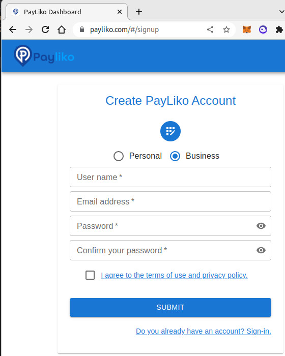
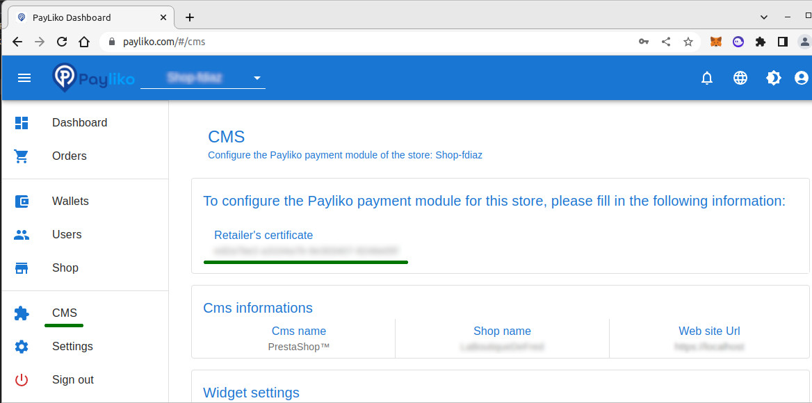

# Payliko payment plugin for PrestaShop

  

Copyright (c) 2021-2022 PayInnov
 
 

  
  

## Requirements

In order to setup Payliko plugin you need :

* [PrestaShop](https://www.prestashop.com/en) 1.7.x
* A Payliko business account see https://payliko.com/

# How to install Payliko payment plugin in PrestaShop

 - Backup your database before installing plugins. Please make sure you create backups.
 - Download the file payinnov_plugin.zip see Github release
 - Go to your PrestaShop admin panel **Modules** / **Module Manager**.
 - Click **Upload a module**, then click **Select file**, find the payinnov_plugin.zip file, select it and click **Open**.

## How to use

When the installation is completed:

 - Enable the plugin.
 - Click **Configure**.
   In the **Configure Settings** tab of the Payliko Module, you should enter your Retailer credentials and then click **Save**.

## API credentials

To create a new Retailer'certificat, you should register a Business account on the PayLiko Dashboard, then go to the CMS page, and copy the uuid string.

  
  

Use that uuid string as a Retailer'certificat in the plugin configuration page.
